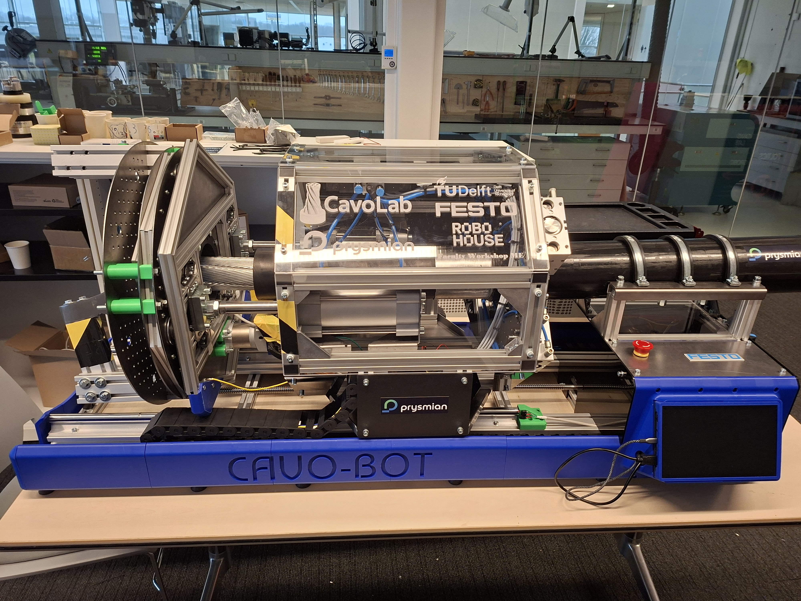
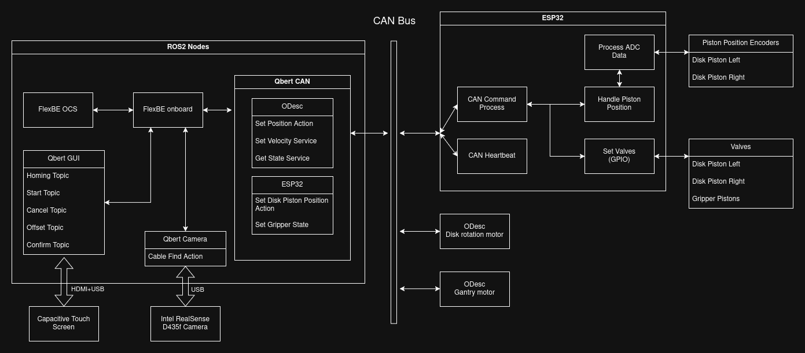
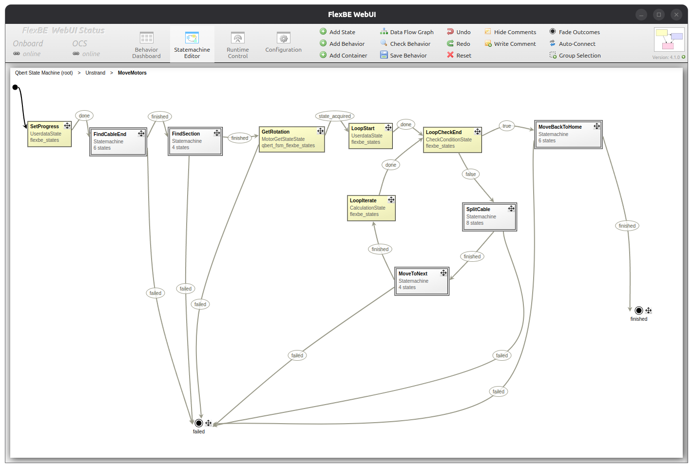

# QbertSoftware

This project contains software used to operate Qbert - a robot developed by CavoLab - a student team from TU Delft for Robotics Minor.

The robot was ordered by Prysmian - a high voltage cable manufacturer. 
The robot's aim is to prepare the conductor for welding it with another end of a cable to install a joint.

## Software Architecture

The software in this repository is split into 2:
 - src - ROS2 packages used for high level control and computer vision
 - qbert_esp - ESPIDF repository with code for the ESP device handling low level functionalities

The overview of the system can be seen here:

### FlexBE State Machine

Main logic of the actions performed by the robot is created using FlexBE - a ROS2 module for creating state machines.

To run FlexBE it requires 2 ros launch files:
 - FlexBE OCS - starts FlexBE GUI where the state machine can be modified and started
 - FlexBE onboard - starts FlexBE state machine executor

To implement functionality for the robot we also created 3 additional packages interacting with different hardware.

### Qbert GUI

A GUI written with PyQt6 implementing basic utilities to safely run the robot.
To communicate with the executor via ROS2 it also starts an internal ROS node with publishers and subscribers.

To make the communication easy to use with FlexBE, it happens over ROS topics using standard message types:
 - Empty (homing, start, cancel)
 - Bool (confirm)
 - Float64 (offset)

### Qbert CAN

This package is responsible for handling all devices communicating over CAN bus. This includes 2 ODescs and the ESP32 inside the robot.
The package uses SocketCAN to publish all CAN messages to a topic which the different nodes can subscribe to.
The [ODrive v0.5.6 CAN protocol](https://docs.odriverobotics.com/v/0.5.6/can-protocol.html) was extended for use by the other devices. To differentiate between different device types, the highest bit of the device ID was reserved.

The ODesc node handles all the communication from and to the different ODescs. Only the needed parts of the ODrive CAN protocol were implemented, these can be found in `odesc_msgs.h`.  
The ESP node handles the communication from and to the ESP32. Custom messages were created for this which can be found in `esp_msgs.h`

Suitable actions and services for higher-level control of the devices were implemented and split into their own namespaces. services and actions related to the ODescs are found in `/odesc/` and those for the ESP32 in `/esp/`.

### Qbert Camera

This is a package responsible for the computer vision part of the project.
It starts a node reading data from RealSense camera.
The computer vision can then be started by calling the appropriate action.

## Dependencies

- Python >= 3
- Python packages specified in `requirements.txt`
- [ROS 2 Jazzy](https://docs.ros.org/en/jazzy/Installation.html)
- [LibRealSense 2](https://github.com/realsenseai/librealsense) - Matching version for realsense-ros package
- [ESP IDF](https://docs.espressif.com/projects/esp-idf/en/stable/esp32/index.html) >= 5.5.0

## Building

### Building ROS packages
1. `source PATH_TO_ROS_JAZZY/setup.bash`
2. If python packages were installed in a venv source it: `source .venv/bin/activate`
3. `colcon build` (Note: do not use --symlink-install as it breaks some packages)

### Building ESP code
1. `cd qbert_esp`
2. `. PATH_TO_ESP_IDF/export.sh`
3. `idf.py build` or `idf.py flash` depending on what is needed

## Running

For running the software in default configuration running the `run.sh` script should be enough.

To explain its contents:
 - For running FlexBE adding the python venv to the PYTHONPATH is necessary (as it cannot find the required packages otherwise), and can be done with `export PYTHONPATH="$PYTHONPATH:$(pwd)/.venv/lib/CORRECT_PYTHON_VERSION/site-packages`
 - After plugging in the USB to CAN adapter the network needs to be set up. It can be done on linux with `sudo ip link set can0 up type can bitrate 250000` command.
 - The packages can then be started with `ros2 launch qbert_bringup full.launch.py`, which launches the 5 packages described above.
